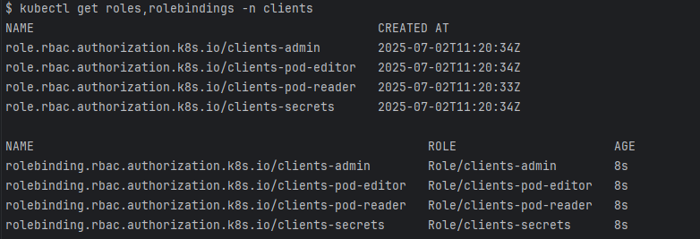
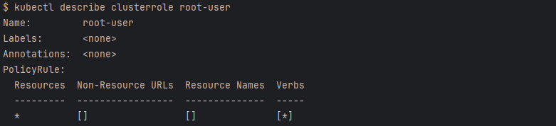
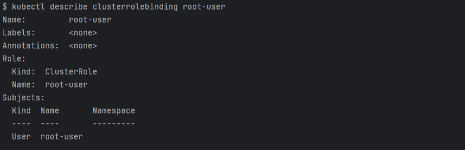

| Роль                                                          | Права роли                                                                    | Группы пользователей                                                                                                    |
|---------------------------------------------------------------|-------------------------------------------------------------------------------|-------------------------------------------------------------------------------------------------------------------------|
| Название роли, которое отвечает требованиям RBAC в Kubernets. | Укажите права, которые необходимо выдать этой роли.                           | Выделите группы пользователей в организации, которые нужно связать с этой ролью.                                        |
| `clients-pod-reader`                                            | [Role:clients]: `get`, `list`, `watch`                                        | Доступ к просмотру информации по `pod` в пределах namespace `clients` - разработчики (`developer`)                        |
| `clients-pod-editor`                                          | [Role:clients]: `get`, `list`, `watch`, `create`, `update`, `patch`, `delete` | Доступ к инфорамции и настройкам `pod` в пределах namespace `clients` - девопсы (`devops`)                                |
| `clients-secrets`                                             | [Role:clients]: `get`, `list`                                                 | Доступ к просмотру секретов в пределах namespace `clients` - специалисты по ИБ (`security-engineer`) |
| `clients-admin`                                               | [Role:clients]: *                                                             | Полный доступ к управлению системой в пределах namespace `clients` - администраторы систем (`admin`)                     |
| `root-user`                                                     | [ClusterRole]: *                                                              | Пользователь с наивысшими привилегиями в системе, который имеет полный доступ к ресурсам и может выполнять любые операции |

1. Создание namespace `clients`
   ```bash
   kubectl create namespace clients
   ```

2. Создание пользователей (сервисных аккаунтов)
   ```bash
   kubectl apply -f ./users/admin.yaml
   kubectl apply -f ./users/developer.yaml
   kubectl apply -f ./users/devops.yaml
   kubectl apply -f ./users/root-user.yaml
   kubectl apply -f ./users/security-engineer.yaml
   ```

3. Создание ролей
   ```bash
   kubectl apply -f ./roles/clients-pod-reader-role.yaml
   kubectl apply -f ./roles/clients-pod-editor-role.yaml
   kubectl apply -f ./roles/clients-secrets-role.yaml
   kubectl apply -f ./roles/clients-admin-role.yaml
   kubectl apply -f ./roles/root-user-cluster-role.yaml
   ```

4. Применяем bindings
   ```bash
   kubectl apply -f ./rolebindings/clients-pod-reader-binding.yaml
   kubectl apply -f ./rolebindings/clients-pod-editor-binding.yaml
   kubectl apply -f ./rolebindings/clients-secrets-binding.yaml
   kubectl apply -f ./rolebindings/clients-admin-binding.yaml
   kubectl apply -f ./rolebindings/root-user-cluster-binding.yaml
   ```

5. Просмотр списка ролей и их bindings в namespace `clients` 
   ```bash
   kubectl get roles,rolebindings -n clients
   ```
   

6. Просмотр информации по роли и binding `root-user`
   ```bash
   kubectl describe clusterrole root-user
   kubectl describe clusterrolebinding root-user
   ```
   

   