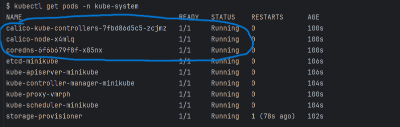
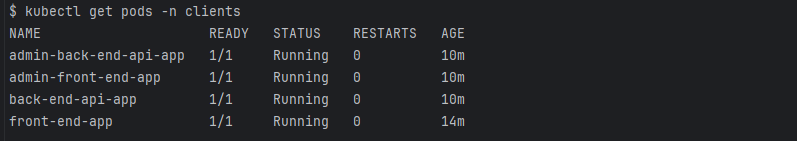
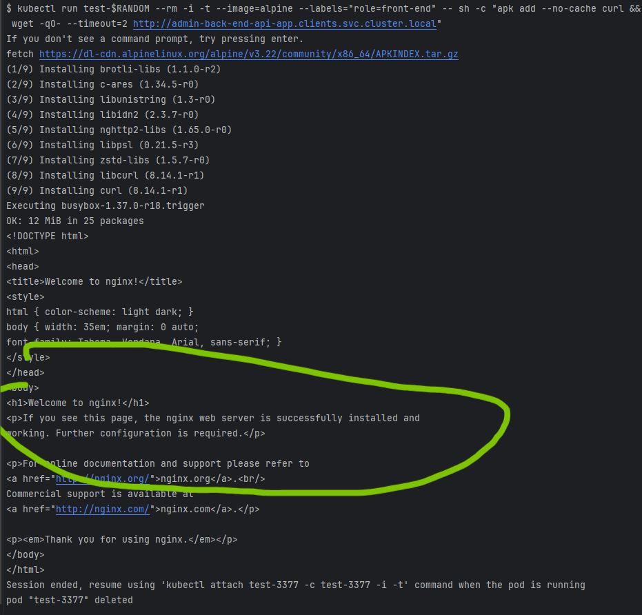
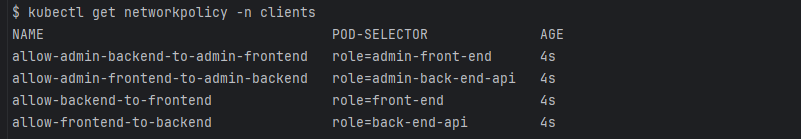
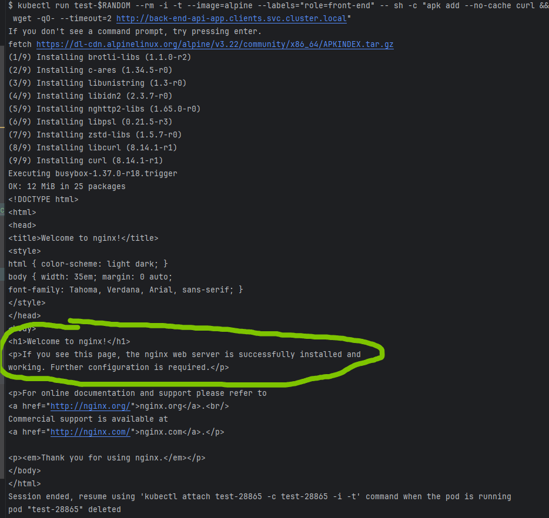
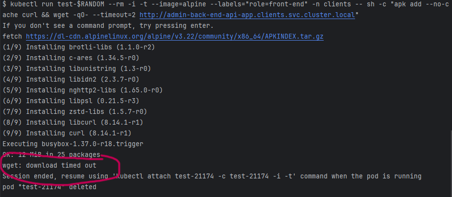

1. Запускаем `minikube` с установленным плагином `calico` для корректного применения сетевых политик 
```bash
minikube start --cni=calico
```

2. Проверяем работу плагина
```bash
kubectl get pods -n kube-system
```


3. Создание namespace `clients`
   ```bash
   kubectl create namespace clients
   ```

4. Разворачиваем четыре сервиса в namespace `clients` и назначаем им метки 
```bash
kubectl run front-end-app --image=nginx --labels role=front-end --expose --port 80 --namespace=clients
kubectl run back-end-api-app --image=nginx --labels role=back-end-api --expose --port 80 --namespace=clients
kubectl run admin-front-end-app --image=nginx --labels role=admin-front-end --expose --port 80 --namespace=clients
kubectl run admin-back-end-api-app --image=nginx --labels role=admin-back-end-api --expose --port 80 --namespace=clients
```


5. Проверяем список сервисов в namespace `clients`
```bash
kubectl get pods -n clients
```



6. Проверка трафика до применения сетевых политик:

от `front-end` к `back-end-api`
```bash
kubectl run test-$RANDOM --rm -i -t --image=alpine --labels="role=front-end" -n clients -- sh -c "apk add --no-cache curl && wget -qO- --timeout=2 http://back-end-api-app.clients.svc.cluster.local"
```


от `front-end` к `admin-back-end-api-app`
```bash
kubectl run test-$RANDOM --rm -i -t --image=alpine --labels="role=front-end" -n clients -- sh -c "apk add --no-cache curl && wget -qO- --timeout=2 http://admin-back-end-api-app.clients.svc.cluster.local"
```



7. Применяем сетевые политики

```bash
kubectl apply -f network-policies.yaml -n clients
```

8. Проверяем что политики применены
```bash
kubectl get networkpolicy -n clients
```


9. Проверка трафика после применения сетевых политик:

от `front-end` к `back-end-api`
```bash
kubectl run test-$RANDOM --rm -i -t --image=alpine --labels="role=front-end" -n clients -- sh -c "apk add --no-cache curl && wget -qO- --timeout=2 http://back-end-api-app.clients.svc.cluster.local"
```


от `front-end` к `admin-back-end-api-app`
```bash
kubectl run test-$RANDOM --rm -i -t --image=alpine --labels="role=front-end" -n clients -- sh -c "apk add --no-cache curl && wget -qO- --timeout=2 http://admin-back-end-api-app.clients.svc.cluster.local"
```

